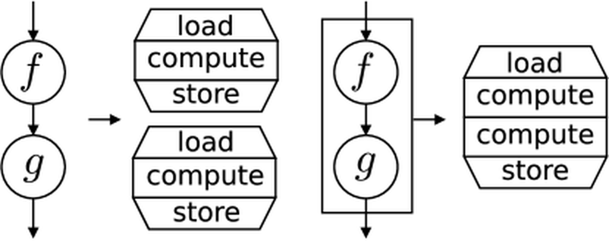

---
theme:
  name: light
---

<!-- newlines: 4 -->
<!-- alignment: center -->

High-Performance Python
===

**Igor Jakus**

Instytut Informatyki
Uniwersytet Wrocławski

Marzec 2026

<!-- end_slide -->

Agenda
===

1. **Dlaczego Python jest wolny?**
2. **NumPy:** Wektoryzacja — wyrzuć pętlę z Pythona
3. **Numba:** JIT na CPU — skompiluj Pythona do kodu maszynowego
4. **torch.compile:** JIT na GPU — skompiluj model
5. **Kernel Fusion:** Dlaczego to przyspiesza?
6. **Trening:** Pozostałe optymalizacje PyTorch
7. **Podsumowanie**

<!-- end_slide -->

<!-- jump_to_middle -->
<!-- alignment: center -->

Dlaczego Python jest wolny?
===

<!-- end_slide -->

Dlaczego Python jest wolny?
---

**1. Dynamic typing**
Python nie zna typów z góry. Każdy `a + b` to:
sprawdź typ `a` → sprawdź typ `b` → znajdź metodę `__add__` → wywołaj ją.
W C kompilator wie, że to `int + int` i generuje jedną instrukcję CPU.

<!-- pause -->

**2. Object boxing**
W C `int` to 4 bajty w rejestrze procesora.
W Pythonie `int` to **pełny obiekt na stercie** (~28 bajtów!) z nagłówkiem, wskaźnikiem na typ i licznikiem referencji.

| **C Integer** | **Python Integer** |
| :--- | :--- |
| **Wartość** (4B) | **ob_refcnt** (8B) — licznik referencji |
| | **ob_type** (8B) — wskaźnik na typ |
| | **ob_size** (8B) — ile "cyfr" wewnętrznych potrzeba do zapisania liczby |
| | **Wartość** (4B+) — właściwy payload |
| **Razem: 4 Bajty** | **Razem: ~28 Bajtów** |

> [!note]
> Python obsługuje dowolnie duże liczby całkowite. Zamiast stałego pola 4-bajtowego, wartość jest przechowywana jako **tablica 30-bitowych "cyfr"**. Pole `ob_size` mówi, ile takich cyfr jest potrzebnych (1 dla małych liczb, więcej dla wielkich).

<!-- end_slide -->

Dlaczego Python jest wolny? (cd.)
---

**3. Reference counting**
Każde przypisanie `x = y` to: zwiększ refcount `y`, zmniejsz refcount starego `x`.
Jeśli refcount spadnie do zera — zwolnij pamięć. To się dzieje **przy każdej iteracji** pętli.

<!-- pause -->

**4. Interpreter dispatch**
Każda instrukcja bytecode przechodzi przez wielki `switch/case` w pętli ewaluacyjnej CPythona. Zero optymalizacji między instrukcjami — każda jest wykonywana niezależnie.

<!-- pause -->

**Filozofia:** Pisz w Pythonie, wykonuj w C/CUDA.

<!-- end_slide -->

Co z PyPy?
---

**PyPy** to alternatywny interpreter z wbudowanym JIT-em.

* **Drop-in replacement** dla CPython — po prostu `pypy3 script.py`
* Świetny dla czystego Pythona (pętle, logika, parsery)

<!-- pause -->

**Problem:** Nie współpracuje dobrze z bibliotekami C:
* NumPy, Pandas, PyTorch — wszystkie opierają się na C-extensions
* W świecie nowoczesnego ML/AI — praktycznie bezużyteczny

<!-- pause -->

**Wniosek:** Zamiast zmieniać interpreter, w Data Science lepiej **zmienić sposób pisania kodu**.

<!-- end_slide -->

<!-- jump_to_middle -->
<!-- alignment: center -->

NumPy: Wektoryzacja
===

*Wyrzuć pętlę z Pythona do C*

<!-- end_slide -->

Wektoryzacja (SIMD)
---

**Intuicja:** Zamiast wysyłać 1000 kurierów z jedną paczką każdy (pętla),
wyślij jedną ciężarówkę z 1000 paczek.

> [!tip]
> **SIMD** = *Single Instruction, Multiple Data*. Jeden rozkaz procesora przetwarza **wiele danych naraz**. Nowoczesne CPU mają rejestry 256/512-bitowe (AVX2/AVX-512), które mogą np. dodać 8 floatów jednocześnie.

> NumPy automatycznie korzysta z SIMD pod spodem — dlatego operacja na tablicy jest szybsza niż pętla po elementach.

<!-- column_layout: [1, 1] -->

<!-- column: 0 -->

**Wolno (Python Loop)**
```python
def cos(a, b):
    dot, na, nb = 0, 0, 0
    for i in range(len(a)):
        dot += a[i] * b[i]
        na  += a[i] ** 2
        nb  += b[i] ** 2
    return dot / (na**0.5 * nb**0.5)
```

<!-- column: 1 -->

**Szybko (NumPy Array)**
```python
def cos(A, B):
    dot = np.sum(A * B, axis=1)
    nA  = np.linalg.norm(A, axis=1)
    nB  = np.linalg.norm(B, axis=1)
    return dot / (nA * nB)
```

<!-- reset_layout -->

<!-- end_slide -->

Wolne vs szybkie biblioteki
---

Nie musisz sam optymalizować — często wystarczy **zmienić bibliotekę** na szybszą.

| Wolna | Szybka alternatywa | Przyspieszenie | Uwagi |
|-------|-------------------|----------------|-------|
| **pip / poetry** | **uv** | 10-100× | Szybki menedżer pakietów w Rust |
| **json** | **orjson** | 5-10× | Napisane w Rust |
| **Pandas** | **Polars** | 10-50× | Lazy execution, query optimization |
| **csv** | **PyArrow** | 10-50× | Columnar format |
| **PIL/Pillow** | **opencv** (cv2) | 2-5× | C++ pod spodem |

<!-- pause -->

💡 Zasada: jeśli coś jest wolne, sprawdź czy ktoś nie napisał tego w Rust/C++.

<!-- end_slide -->


Numba — @njit
---

**Problem:** NumPy nie ma gotowej funkcji na Twój algorytm.
Pętla w Pythonie jest za wolna. Co robić?

<!-- pause -->

**Numba** kompiluje Pythona do kodu maszynowego przez LLVM.
Dokładnie ta sama składnia — ale działa z prędkością C.

```python
from numba import njit

@njit
def foo(X, Y):
    n = X.shape[0]
    result = np.empty(n)
    for i in range(n):
        s = 0.0
        for j in range(X.shape[1]):
            s += (X[i, j] - Y[i, j]) ** 2
        result[i] = s ** 0.5
    return result
```

<!-- end_slide -->

Numba — prange
---

**Zrównoleglenie obliczeń na CPU:**
Wystarczy dodać `parallel=True` i zmienić `range` na `prange`. Numba rozdzieli iteracje pętli automatycznie pomiędzy dostępne wątki CPU!

```python
from numba import njit, prange

@njit(parallel=True)
def parallel_distances(X, Y):
    n = X.shape[0]
    result = np.empty(n)
    for i in prange(n):     # Automatycznie na wielu rdzeniach!
        result[i] = compute_distance(X[i], Y[i])
    return result
```

<!-- end_slide -->

Kiedy Numba, a kiedy NumPy?
---

| Sytuacja | Narzędzie |
|----------|-----------|
| Operacja istnieje w NumPy (`np.sum`, `np.dot`, ...) | **NumPy** |
| Custom algorytm z pętlami (symulacja, grafowy, ...) | **Numba `@njit`** |
| Chcesz łatwą parallelizację CPU | **Numba `prange`** |
| Obliczenia na GPU (tensory, gradienty) | **PyTorch** |

<!-- end_slide -->

<!-- jump_to_middle -->
<!-- alignment: center -->

torch.compile: JIT na GPU
===

*Ten sam pomysł — ale dla całego modelu*

<!-- end_slide -->

Eager vs Compiled
---

**Eager Mode (domyślny):**
Wykonanie **linijka po linijce**.
1. PyTorch zleca małą operację (`Add`) → GPU uruchamia kod i kończy.
2. PyTorch zleca kolejną (`ReLU`) → GPU uruchamia kolejny kod i kończy.
> **Skutek:** Narzut (overhead) komunikacji CPU-GPU pożera większość czasu.

<!-- pause -->

**Compiled Mode (`torch.compile`):**
PyTorch "patrzy w przyszłość" i generuje całościowy kod:
1. Analizuje całą sekwencję (tworzy **graf obliczeniowy**).
2. Łączy operacje w jeden zoptymalizowany kernel (w języku Triton).
3. GPU dostaje "gotowy przepis" do wykonania naraz.
> **Skutek:** Zero pytań do Pythona o kolejne kroki. Gigantyczna redukcja narzutu.

```python
model = torch.compile(model)
```

```python
@torch.compile
class Model(torch.nn.Module):
    ...
```


<!-- end_slide -->

<!-- jump_to_middle -->
<!-- alignment: center -->

Kernel Fusion
===

*Dlaczego torch.compile tak bardzo przyspiesza?*

<!-- end_slide -->

Bottleneck: Pamięć, nie obliczenia
---

GPU jest **niewiarygodnie szybkie** w obliczeniach, ale wolne w **czytaniu i pisaniu do pamięci VRAM**.

```latex +render
\[
\operatorname{GeLU}(x) = x \cdot 0.5 \cdot \left(1 + \operatorname{erf}\left(\frac{x}{\sqrt{2}}\right)\right)
\]
```

<!-- column_layout: [5, 4] -->

<!-- column: 0 -->

**Bez fuzji (Eager Mode) — 5 kerneli:**
1. `y = x / 1.414` *(czytaj x, pisz y do VRAM)*
2. `z = erf(y)` *(czytaj y, pisz z do VRAM)*
3. `w = 1 + z` *(czytaj z, pisz w do VRAM)*
4. `v = 0.5 * w` *(czytaj w, pisz v do VRAM)*
5. `out = x * v` *(czytaj x, v, pisz out)*

**5 kerneli × 2 transfery (R/W) = 10 operacji na VRAM!**

<!-- column: 1 -->

**Z fuzją (Compiled Mode):**
```python
@torch.compile
def gelu(x):
    return x * 0.5 * (1.0 + torch.erf(x / 1.414))
```
Powstaje **1 super-kernel** (Triton). 
Całe liczenie dzieje się w superszybkich *rejestrach*. VRAM ogranicza się do wejścia i wyjścia.
`czytaj z x → zrób cokolwiek → pisz z powrotem`

**1 super-kernel × 2 transfery (R/W) = 2 operacje na VRAM!**

<!-- reset_layout -->

> **Zapamiętaj:** To jest właśnie *kernel fusion* — drastyczna redukcja transferu pamięci. Stąd bierze się gigantyczne przyspieszenie z `torch.compile`!

<!-- end_slide -->

Wizualizacja: Kernel Fusion
---

<!-- column_layout: [1, 5, 1] -->
<!-- column: 1 -->

<!-- reset_layout -->

<!-- end_slide -->

<!-- jump_to_middle -->
<!-- alignment: center -->

Optymalizacje Treningu
===

*Zestaw praktycznych trików PyTorch*

<!-- end_slide -->

Wąskie Gardła w Deep Learningu
---

Trening modelu to pipeline:

1. **Dysk/CPU:** Wczytywanie i preprocessing danych.
2. **PCIe:** Transfer RAM → VRAM.
3. **GPU:** Trening (forward + backward + update).

<!-- pause -->

> [!important]
> Jeśli GPU czeka na dane (volatile utilization < 90%), to **marnujesz pieniądze**.

<!-- end_slide -->

1. Fast Loader & Pin Memory
---

**Problem:** GPU przetwarza batch w milisekundach, ale czeka na dane z CPU.

Domyślnie PyTorch wczytuje dane **jednym procesem, synchronicznie** — GPU stoi bezczynne.

<!-- pause -->

**Trzy rozwiązania:**

* **`num_workers=N`** — uruchamia N osobnych procesów, które **w tle** przygotowują kolejne batche, podczas gdy GPU liczy obecny
* **`pin_memory=True`** — "przypina" pamięć RAM, żeby GPU mogło ją kopiować bezpośrednio przez szynę PCIe (**DMA — Direct Memory Access**), bez angażowania CPU
* **`persistent_workers=True`** — nie ubija procesów po każdej epoce (tworzenie procesu jest kosztowne)

```python
loader = DataLoader(
    dataset,
    batch_size=128,
    num_workers=4,         # 4 procesy czytają w tle
    pin_memory=True,       # GPU kopiuje dane samo (DMA)
    persistent_workers=True # Procesy żyją między epokami
)
```

<!-- end_slide -->

2. Tensor Cores (TF32 — TensorFloat-32)
---

Karty RTX 30xx+ / A100 mają dedykowane **Tensor Cores** — rdzenie do mnożenia macierzy.

<!-- pause -->

> [!note]
> Liczba zmiennoprzecinkowa IEEE 754 składa się z trzech części:
> * **Znak** (1 bit) — plus/minus
> * **Wykładnik** — określa **rząd wielkości** (jak daleko od zera, np. 10⁻³⁸ do 10³⁸)
> * **Mantysa** — określa **precyzję** (ile cyfr znaczących), zawsze z przedziału **[1, 2)**
>
> **Przykład:** `-6.5` = `-1.625 × 2²` → znak = minus, wykładnik = `2`, mantysa = `1.625`.
> **Wykładnik** mówi „rząd 2²", **mantysa** mówi „dokładnie 1.625 × ten rząd".

<!-- pause -->

| Format | Znak | Wykładnik | Mantysa | Razem |
|--------|------|-----------|----------|-------|
| float32 | 1 bit | 8 bit | 23 bit | **32 bit** |
| **→ TF32** | **1 bit** | **8 bit** | **10 bit** | **19 bit** |
| float16 | 1 bit | 5 bit | 10 bit | **16 bit** |

<!-- pause -->

**Dlaczego to działa?** Gradienty w deep learningu nie wymagają 23-bitowej precyzji mantysy. 10 bitów wystarczy — a 8-bitowy wykładnik zachowuje pełny zakres dynamiczny float32.

```python
# Jedna linijka — aktywuje Tensor Cores
torch.set_float32_matmul_precision('high')
```

<!-- end_slide -->

2b. bfloat16 — „Brain Float"
---

| Format | Znak | Wykładnik | Mantysa | Razem |
|--------|------|-----------|----------|-------|
| float32 | 1 bit | 8 bit | 23 bit | **32 bit** |
| TF32 | 1 bit | 8 bit | 10 bit | **19 bit** |
| float16 | 1 bit | 5 bit | 10 bit | **16 bit** |
| **→ bfloat16** | **1 bit** | **8 bit** | **7 bit** | **16 bit** |

<!-- pause -->

**Kluczowa intuicja:** bfloat16 to „obcięty float32" — **ten sam 8-bitowy wykładnik**, więc ten sam zakres dynamiczny (±3.4 × 10³⁸). Różnica to tylko mniej bitów mantysy (7 vs 23).

<!-- pause -->

**Dlaczego to ma znaczenie?**

* **float16** ma 5-bitowy wykładnik → zakres tylko ±65504. Małe gradienty (np. 10⁻⁸) **underflow'ują do zera** → potrzebny `GradScaler`
* **bfloat16** ma 8-bitowy wykładnik → pełny zakres float32. Gradienty **nie zanikają** → `GradScaler` **niepotrzebny**

<!-- pause -->

| | float16 | bfloat16 |
|---|---------|----------|
| Precyzja | Wyższa (10 bit) | Niższa (7 bit) |
| Zakres dynamiczny | Mały (5 bit exp) | Pełny (8 bit exp) |
| GradScaler | **Wymagany** | **Zbędny** |
| Stabilność treningu | Wymaga ostrożności | Stabilny out-of-the-box |

<!-- pause -->

**W praktyce:** Większość nowoczesnych modeli językowych trenuje w **bfloat16** .

<!-- end_slide -->

3. AMP — Automatic Mixed Precision
---

**AMP** = *Automatic Mixed Precision* — automatycznie wybiera precyzję per-operacja.

| Precyzja | Operacje |
|----------|----------|
| **float16** | Mnożenie macierzy (`matmul`, `linear`, `conv`), attention |
| **float32** | BatchNorm, LayerNorm, softmax, loss functions, redukcje (`sum`, `mean`) |

<!-- pause -->

**Problem z float16:** Mały zakres wykładnika (5 bit) → małe gradienty **underflow'ują** do zera.

**Rozwiązanie:** `GradScaler` — mnoży loss przez dużą liczbę przed `.backward()`,
żeby gradienty "zmieściły się" w float16. Potem dzieli je z powrotem przed `optimizer.step()`.

```python
scaler = torch.amp.GradScaler()

for data, target in loader:
    with torch.autocast("cuda"):    # fp16 dla matmul, fp32 dla norm
        loss = model(data)

    scaler.scale(loss).backward()    # Skaluj gradienty w górę
    scaler.step(optimizer)           # Podziel z powrotem + update
    scaler.update()                  # Dostosuj skalę
```

<!-- pause -->

💡 **bfloat16** (Brain Float, format Google Brain) ma **8-bitowy wykładnik** — taki sam zakres jak float32!
Dzięki temu małe gradienty nie zanikają i **GradScaler nie jest potrzebny**.
Wadą jest mniejsza precyzja (7 bit mantysy vs 10 bit w float16).

<!-- end_slide -->

4. VRAM Caching & Fused Optimizer
---

<!-- column_layout: [1, 1] -->

<!-- column: 0 -->

**VRAM Caching**
Jeśli dataset mieści się w VRAM — załaduj go **raz**.

```python
# 0% użycia PCIe podczas treningu!
data = data.to("cuda")
```

<!-- column: 1 -->

**Fused Optimizer**
Update wag w jednym kernelu CUDA.

```python
optimizer = optim.AdamW(model.parameters(), lr=3e-4, fused=True)
```

<!-- reset_layout -->

<!-- end_slide -->

Podsumowanie
===

Wydajny Python = **unikanie Pythona** tam, gdzie to możliwe.

<!-- pause -->

1. **NumPy** — wektoryzacja, operacje w C
2. **Numba** — JIT, gdy NumPy nie wystarczy
3. **torch.compile** — JIT na GPU, Kernel Fusion
4. **Trening** — DataLoader, AMP, Tensor Cores, Fused Optimizer

<!-- pause -->

**Motyw przewodni:**
*Pisz Pythona, który wywołuje szybki kod.*

<!-- end_slide -->

<!-- jump_to_middle -->
<!-- alignment: center -->

Dziękuję za uwagę!
---
Pytania?

<!-- end_slide -->

<!-- jump_to_middle -->
<!-- alignment: center -->

Bonus
===

<!-- end_slide -->

Bonus: Tryby torch.compile
---

```python
# Domyślny — dobry balans
model = torch.compile(model, mode="default")

# Mniej recompilacji — mniej overhead z CPU
model = torch.compile(model, mode="reduce-overhead")

# Próbuje WSZYSTKICH wariantów kerneli
# Wolna kompilacja, najszybsze wykonanie
model = torch.compile(model, mode="max-autotune")
```

<!-- pause -->

**Uwaga:** Pierwsza iteracja po `compile` jest wolna (kompilacja).
Kolejne — znacznie szybsze. Dlatego warto rozgrzać model przed benchmarkiem.

> [!important]
> `torch.compile` najlepiej działa na **Linux + karty Nvidia**.

<!-- end_slide -->

Bonus: dis.dis() — Bytecode Pythona
---

Co tak naprawdę robi prosta pętla?

<!-- column_layout: [1, 1] -->

<!-- column: 0 -->

```python
import dis
def loop():
    s = 0
    for i in range(1000):
        s += i
    return s
dis.dis(loop)
```

<!-- column: 1 -->

```
  LOAD_CONST    0          # załaduj 0
  STORE_FAST    s          # s = 0
  LOAD_GLOBAL   range      # znajdź 'range'
  LOAD_CONST    1000       # załaduj 1000
  CALL          1          # range(1000)
  GET_ITER                 # iterator
  FOR_ITER      ...        # ← powtórz 1000x:
    STORE_FAST  i          #   i = next()
    LOAD_FAST   s          #   załaduj s
    LOAD_FAST   i          #   załaduj i
    BINARY_OP   +=         #   s + i
    STORE_FAST  s          #   zapisz s
```

<!-- reset_layout -->

**Każda iteracja: 5 instrukcji bytecode** × narzut interpretera.

<!-- end_slide -->


Bonus: no_grad vs inference_mode
---

**`torch.no_grad()` vs `torch.inference_mode()`:**

Oba wyłączają liczenie gradientów, ale różnią się w detalach implementacyjnych pod maską:

* **`no_grad`** — traktuje tensory jako typowe obiekty z `requires_grad=False`. Utrzymuje "version tracking" (przydatne, gdy wepniesz taki tensor do grafu, który liczy gradient, aby unikać błędów modyfikacji in-place).
* **`inference_mode`** — ekstremalna optymalizacja C++. Wyłącza wszelkie dodatkowe trackingi. Rzuca crashem z asercji przy jakiejkolwiek próbie użycia do gradientów. Maksymalnie oszczędza VRAM i CPU.

**Zasada:** 
* Czysta inferencja (ewaluacja, deployment, generowanie) → `inference_mode`.
* Proces mieszany (wyciąganie cech, częściowy autograd) → `no_grad`.
